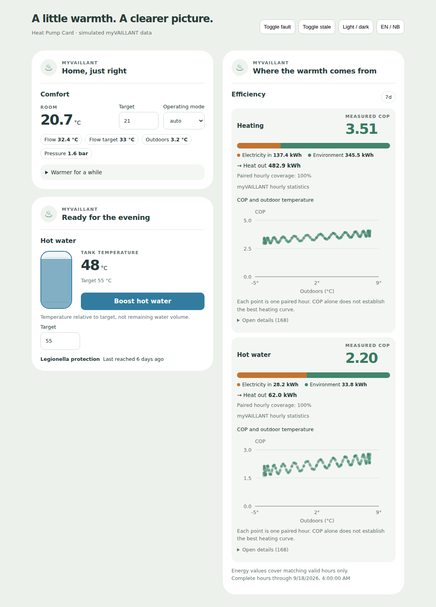
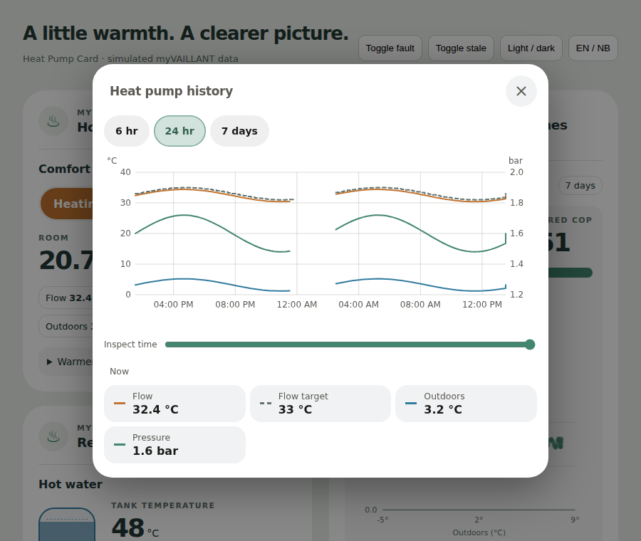
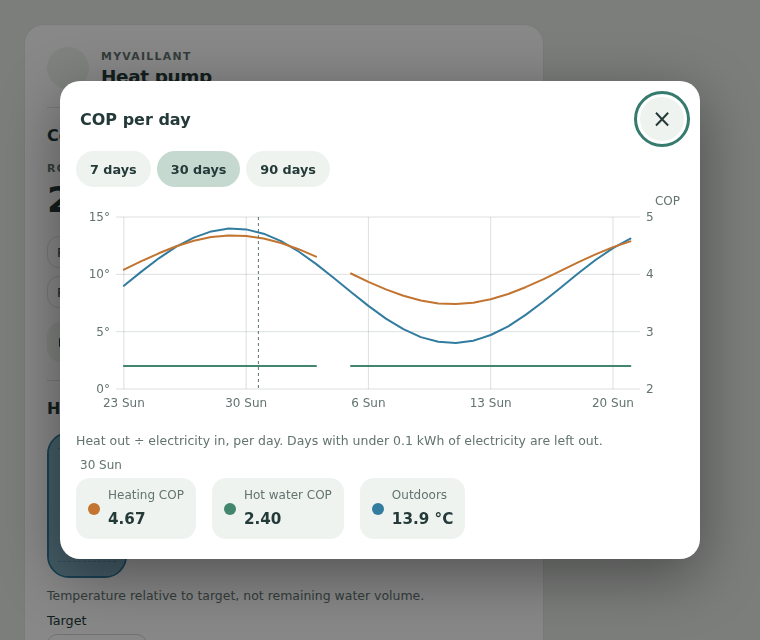

# Heat Pump Card

A Home Assistant dashboard card for [myVAILLANT / myPyllant](https://github.com/signalkraft/mypyllant-component): room comfort, hot water and measured energy efficiency. No companion integration or template sensors required.

One card can show all three panels, or you can put separate instances on your climate and energy dashboards. Default and Bubble appearances, a visual editor, English and Norwegian Bokmål are included.



## Installation

Add `https://github.com/mvheimburg/lovelace-heatpump` as a **Dashboard** custom repository in HACS, then install Heat Pump Card. HACS validation uses category `plugin`.

For manual installation, copy `dist/heatpump-card.js` to `/config/www/heatpump-card.js` and add `/local/heatpump-card.js` as a JavaScript module resource under dashboard resources. Reload your browser. Install and configure myPyllant first.

```yaml
type: custom:heatpump-card
entity: climate.huset_zone_zone_1_circuit_0_climate
appearance: bubble
cop_window: 7d
```

Instead of `entity`, you can set `entry: <mypyllant config entry ID>`. With exactly one enabled myPyllant entry, both can be omitted. The visual editor offers a climate entity field and an entry ID field.

```yaml
# Separate card on the energy dashboard
type: custom:heatpump-card
entry: YOUR_CONFIG_ENTRY_ID
mode: efficiency
cop_window: 30d
```

## Configuration

| Option                     | Default               | Meaning                                                                      |
| -------------------------- | --------------------- | ---------------------------------------------------------------------------- |
| `entity`                   | Auto                  | myPyllant climate entity anchoring the entry, system and zone.               |
| `entry`                    | Auto                  | Config entry ID; used without an entity anchor.                              |
| `name`                     | Localized “Heat pump” | Card title.                                                                  |
| `mode`                     | `all`                 | `all`, `comfort`, `water`, `efficiency`.                                     |
| `appearance`               | `default`             | `default` or `bubble`.                                                       |
| `show_hot_water`           | `true`                | Show the water panel when allowed by mode.                                   |
| `show_efficiency`          | `true`                | Show the efficiency panel when allowed by mode.                              |
| `cop_window`               | `7d`                  | `24h`, `7d`, `30d`.                                                          |
| `allow_curve_edit`         | `false`               | Expose heating curve and minimum flow number controls under Comfort.         |
| `legionella_interval_days` | `7`                   | Reminder interval, not a protection schedule or a guarantee of sanitization. |
| `cooling_entity`           | None                  | Heating/cooling switch outside myVAILLANT, described below.                  |
| `entities`                 | Auto                  | Optional role overrides, listed below.                                       |

Comfort shows current room temperature, target, available HVAC modes, flow readings, outdoor temperature and pressure. Expand **Warmer for a while** to start a myPyllant quick veto using the displayed target and chosen duration (1–12 hours). The integration's duration number appears while a veto is active; setting it to zero cancels it. Controls respect reported ranges, steps and availability.

Tap any of the readings (flow, flow target, outdoor, pressure) to open their **history together** in one chart: temperatures on the left-hand scale, water pressure on the right in its own unit, flow target dashed. Choose 6 hours, 24 hours (the default) or 7 days. Move the pointer or a finger across the chart to read every value at that moment; otherwise the legend shows the current values, and tapping a legend entry opens that sensor in Home Assistant. Unavailable spells are left as gaps. The data comes from Home Assistant's recorder (0.4.0).



Tap the **tank temperature** or its target to see the hot water history: the tank temperature with the target as a dashed step. When the integration has no separate tank or target sensor, both come from the water heater's own `current_temperature` and `temperature`.

Tap a **measured COP** to see the COP per day for heating and hot water over 7, 30 (the default) or 90 days, with the day's mean outdoor temperature. Each day is heat out ÷ electricity in, from the same statistics as the efficiency summary; a day with under 0.1 kWh of electricity is left as a gap rather than an extreme ratio (0.5.0).



To switch between heating and cooling with your own control, set `cooling_entity` to a `switch` or `input_boolean` (for example one that changes over your heat pump or its circuits). Comfort then shows a **Heating | Cooling** switch: **Cooling** turns the entity on, **Heating** turns it off. The card sends only that call; it does not change myVAILLANT's operating mode. If the entity is unavailable or missing, the switch is disabled and says so. The visual editor lists your switches and input booleans.

Hot water shows tank temperature relative to its target and a boost button with explicit active/stop state. **The filled column is temperature relative to target, not a percentage of remaining hot water or a shower count.** The legionella reminder displays the integration's last reported temperature-reached date, including unknown or future dates.

Faults from the trouble-code sensor take precedence at the top of every mode, including efficiency. The details button opens Home Assistant's entity dialog. Faults do not automatically stop the pump.

## Discovery and overrides

The card reads Home Assistant's entity and device registries and limits discovery to the selected `mypyllant` entry and system. Device identifiers select the zone, circuit and tank; domain, unique ID, original name and device class identify roles. Entity-ID suffixes are the final fallback, so area prefixes and ordinary entity renames do not break discovery.

Without an anchor, the first heating zone by registry identity (Ambisense and ventilation climates are excluded) is selected. Its associated circuit index is used when exposed in state attributes or the integration's original name; otherwise the first circuit is used. A recognized heat-pump model is preferred over auxiliary energy devices. Ambiguous meters are omitted and reported rather than silently combined. Different energy devices are never divided to form a COP.

Use an override for an ambiguous role or unusual installation. Overrides must resolve to enabled entities of the correct domain in the selected entry and system:

```yaml
entities:
  flowTarget: sensor.teknisk_heating_circuit_huset_circuit_0_flow_temperature_setpoint
  heatingElectric: sensor.huset_device_0_flexocompact_exclusiv_consumed_electrical_energy_heating
```

Roles: `climate`, `water`, `flow`, `flowTarget`, `outdoor`, `pressure`, `tank`, `waterTarget`, `boost`, `legionella`, `quickVeto`, `curve`, `minFlow`, `trouble`, `heatingElectric`, `heatingHeat`, `heatingEnvironment`, `waterElectric`, `waterHeat`, `waterEnvironment`.

Use `entity` to choose a zone. Role overrides are advanced: when overriding a tank or circuit entity, provide the corresponding companion roles from that same device.

## How COP is calculated

The card requests hourly **long-term statistics** over the last 24, 168 or 720 complete UTC hours, plus a preceding baseline hour. The current partial hour is excluded. The latest complete-hour endpoint is shown below the panel; the integration may still be catching up within that window.

For each heating/hot-water pair:

1. Prefer myPyllant's external hourly statistics: `mypyllant:<registry unique ID>`, lowercased with hyphens replaced by underscores. These preserve the API's actual energy buckets.
2. Fall back to entity recorder statistics when the external pair is unavailable. Both sides use the same source; the source is labelled.
3. Ask Home Assistant to convert energy to kWh and outdoor temperature to °C. Incompatible statistics units are excluded.
4. Subtract adjacent cumulative `sum` values. Skip negative deltas and missing or nonfinite values. Never bridge a missing hour to make an hourly estimate.
5. Pair electricity and generated heat by timestamp. COP is **sum of generated heat / sum of electricity** for those same valid hours, not the average of hourly COP values.

Zero electricity produces no COP. No usable statistics produces a missing-data message, not zero consumption. Coverage is shown for every result; incomplete results describe only the usable paired hours. A reset excludes its interval. A six-hour gap also excludes the recovery interval when its change cannot be allocated to a single hour. HA may already compensate `total_increasing` resets in its recorded `sum`.

The stacked bar shows independently reported electricity and environmental energy, with reported heat output beside it. Environmental energy is omitted if it does not cover every paired energy hour; it is never inferred as `heat - electricity`. Sensor timing or losses can mean the inputs and output differ.

The diagnostic plot pairs hourly COP with the outdoor sensor's mean at the same timestamp. Heating and hot water have separate plots and accessible data tables. Recorder counter fallback can contain delayed cloud catch-up changes: use the integration's external statistics for meaningful hourly diagnostics. No best-curve recommendation is inferred from the plot.

Statistics require Home Assistant's recorder and compatible long-term statistics. New installations need time to accumulate them; the card cannot recreate purged or never-recorded data. Statistics requests are coalesced within the browser connection and cached for five minutes. Reconnects, registry changes and Retry invalidate the cache.

## Stale data and limitations

Unavailable live entities retain their last valid reading **in browser memory**, visibly marked stale with that reading's update timestamp. Actions are disabled while their target is unavailable or the connection/discovery is not ready. A fresh page load cannot recover previously unseen live values and shows no invented timestamp. Service failures are visible; a successful call reports that the card is waiting for the device's update.

This frontend does not create entities for Energy dashboards, automations or other templates. A template such as `sensor.energy_total_kwh` cannot be removed solely because this card calculates COP; those consumers still need a real sensor.

Time programmes, Vaillant pairing/account management, KNX distribution and tariff optimization are outside this card. No live household credentials or real instance history were used during development; the test fixtures are explicitly synthetic.

## Development

```sh
npm ci
npm test
npm run lint
npm run typecheck
npm run build
```

The browser suite requires Chromium (`npx playwright install --with-deps chromium`). It tests discovery isolation and renamed entities, winter/summer/reset/outage arithmetic, statistics transport, controls, stale states and the editor. The implementation follows [myPyllant entity definitions](https://github.com/signalkraft/mypyllant-component/tree/c8cb4c4063efb044d61c5e7df893d0ce0a03c339/custom_components/mypyllant) and [Home Assistant's recorder WebSocket contracts](https://github.com/home-assistant/frontend/blob/dev/src/data/recorder.ts).

Commit both `dist/heatpump-card.js` and its source map. CI runs tests, lint, type checking and build, then verifies no `dist/` drift. A push to `main` releases `v<package.json version>` after CI passes, attaching `heatpump-card.js`; bump the package and lockfile version for a new release.

Bubble appearance reads `--bubble-main-background-color`, `--bubble-secondary-background-color`, `--bubble-accent-color`, `--bubble-border`, `--bubble-border-radius`, `--bubble-box-shadow`, `--bubble-icon-background-color`, `--bubble-icon-border-radius`, `--bubble-sub-button-background-color` and `--bubble-sub-button-border-radius`.

Run `npm run dev` and visit `http://127.0.0.1:5173/demo/` for a simulated, interactive preview with fault, stale-data, dark-theme and language switches. It does not connect to Home Assistant or call real devices.

### Language (0.1.1)

The card and editor follow Home Assistant's active `hass.language`, falling back to `hass.locale.language`. Bokmål supports `nb`, `nb-NO`, and `no` (including case and underscore variants); existing `nn` support is retained. Other languages use English labels. HVAC modes, time windows, validation messages, accessible descriptions, dates and efficiency chart/table numbers follow the selected language and update when it changes. Custom names, entity IDs and service/configuration values remain unchanged.

## Color schemes

Choose **Color scheme** in the card's visual editor. The setting is per card and
works with both **Default** and **Bubble** appearance, including in-card dialogs.
Every card supplied by this package offers the same choices:

| Scheme                   | YAML value       | Palette                                                 |
| ------------------------ | ---------------- | ------------------------------------------------------- |
| Home Assistant (default) | `home-assistant` | Follows your dashboard theme and Bubble color variables |
| Bright                   | `bright`         | White surfaces with blue accents                        |
| Warm                     | `warm`           | Ivory surfaces with warm brown accents                  |
| Mint                     | `mint`           | Pale green surfaces with green accents                  |
| Sky                      | `sky`            | Pale blue surfaces with blue accents                    |
| Lavender                 | `lavender`       | Pale purple surfaces with purple accents                |

For example, add these options to your existing card configuration:

```yaml
appearance: bubble
color_scheme: mint
```

The five light schemes stay light even on a dark dashboard and override inherited
colors only within this card. Status colors retain their meaning (green for
success, amber for warnings and red for errors). Remove `color_scheme` or choose
**Home Assistant** to follow the dashboard again. Existing configurations keep
their current appearance. Scheme names and the editor label support English and
Norwegian Bokmål; YAML values remain unchanged in either language. Static
card-picker metadata remains English because it has no Home Assistant language
context.
